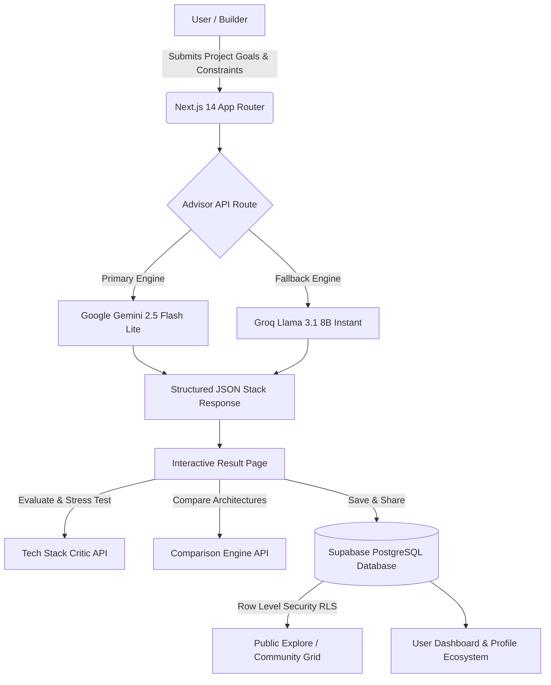

<div align="center">

# ⚡ Toolvise
### The AI-Powered Tech Stack Advisor & Architectural Truth Engine

[](https://nextjs.org/)
[](https://www.typescriptlang.org/)
[](https://tailwindcss.com/)
[](https://supabase.com/)
[](https://ai.google.dev/)
[](https://groq.com/)

---

<p align="center">
  <b>Stop Guessing. Start Building.</b><br/>
  Tell Toolvise what you are building in plain English—our dual-engine AI analyzes your goals, constraints, skill level, and budget to craft an opinionated, production-ready tech stack recommendation complete with trade-offs, critical reviews, and step-by-step learning roadmaps.
</p>

</div>

---

## 🌟 Overview

Choosing the right technology stack in today's fast-moving software ecosystem is overwhelming. Should you use Next.js or Astro? PostgreSQL or MongoDB? Is your architecture ready for 10,000 concurrent users, or will it hit a scaling bottleneck on week two?

**Toolvise** is an intelligent, full-stack web application designed to eliminate architectural paralysis. By combining the power of **Google Gemini 2.5 Flash Lite** and **Groq Llama 3.1 8B Instant**, Toolvise acts as your personal Principal Software Architect. Whether you are building a weekend MVP, practicing modern full-stack development, or architecting a venture-backed startup product, Toolvise delivers deep, actionable insights tailored specifically to your exact constraints and preferred building style (including **Vibe Coding ✨** with modern AI code assistants).

---

## 🔥 Key Features

### 🤖 1. Multi-Engine AI Stack Advisor (`/advisor`)
- **Tailored Parameters:** Input your project description, skill level (*Beginner, Intermediate, Advanced*), budget constraints (*Free Only, Mix of Free & Paid, Budget Doesn't Matter*), project goal (*Learn & Practice, Build MVP Fast, Production Ready App, Freelance Project, Startup Product*), detail level (*Quick Glance, Balanced, Deep Dive*), and preferred build style (*Traditional Coding, Vibe Coding ✨, No-Code/Low-Code*).
- **Vibe Coding Integration:** When "Vibe Coding ✨" is selected, Toolvise intelligently recommends modern AI coding companions (*Cursor, Windsurf, Bolt.new, v0, Lovable, Claude Artifacts*) aligned with your tech stack.
- **Structured Recommendations:** Generates categorized tool selections across **Frontend, Backend, Database, AI, Design, and DevOps**, complete with direct learning resources, difficulty ratings, trending status (`isTrending`), alternatives, and potential pitfalls.
- **Actionable Roadmap:** Provides a step-by-step implementation guide from Day 1 to production deployment.

### ⚡ 2. Architectural Scorecard & Verdict
Every stack recommendation is evaluated on a rigorous **1–10 scale** across five critical engineering dimensions:
- 🚀 **Speed to Ship:** How quickly can you go from zero to MVP?
- 💰 **Cost Efficiency:** Will this run comfortably on free tiers, or cause unexpected cloud billing spikes?
- 📈 **Scalability:** Can this stack handle hyper-growth without full rewrites?
- 👶 **Beginner Friendliness:** Is the learning curve steep, or well-supported by documentation?
- 🎨 **Flexibility:** How easily can you pivot features or migrate services?
- **Overall Score (1–100):** Normalized aggregate score accompanied by a candid Principal Engineer verdict.

### ⚔️ 3. Head-to-Head Comparison Engine (`/compare`)
- Compare any two saved or generated tech stacks side-by-side.
- AI highlights category winners, distinct pros and cons, and precise `whenToUse` scenarios (*e.g., "Use Stack A for rapid prototyping and edge performance; use Stack B for complex relational data and enterprise compliance"*).

### 🕵️ 4. Tech Stack Critic (`/api/critic`)
Before committing to code, invoke the **Tech Stack Critic**—a strict Principal Engineer persona designed to stress-test your stack.
- Identifies **hidden engineering risks** and operational overhead.
- Uncovers **missing architectural pieces** (*e.g., monitoring, error tracking, automated backups, authentication*).
- Pinpoints exact **scaling bottlenecks** (*e.g., connection limits on serverless databases, cold starts*).

### 🌐 5. Community Stacks, Remixing & Discussions (`/explore`)
- **Public Stack Gallery:** Explore stacks shared by developers worldwide, filter by tags/goals, and discover trending architectures.
- **Stack Remixing (`?remix=slug`):** Found a stack you like but want to swap the database or change the budget? Click **Remix** to prefill the advisor with the original parameters and generate your customized version.
- **Rich Discussions & Upvoting:** Engage in technical discussions on community stacks with markdown comments (`CommentsSection.tsx`) and upvote top engineering solutions.

### 👥 6. Developer Profiles & Social Ecosystem (`/people`, `/profile/[username]`)
- **Comprehensive Profiles:** Custom username, avatar, bio, website link, and verified skill badges.
- **Peer Skill Endorsements (`SkillsManager.tsx`):** Add technical skills (*e.g., Next.js, Supabase, Rust, Docker*) and receive mutual endorsements from peers.
- **Portfolio & Work History:** Showcase your real-world experience, educational background, portfolio projects, and GitHub repositories directly on your Toolvise profile.
- **Follower Network:** Follow top architects and builders to track peer activity.

### 📊 7. Personal Dashboard & Activity Feed (`/dashboard`, `/activity`, `/notifications`)
- Centralized workspace to manage all saved stacks with public/private visibility controls.
- Real-time activity feeds and unread notification counters (`getUnreadCount`) keeping you informed on upvotes, comments, and new followers.
- Dedicated **Admin Dashboard (`/admin`)** for system monitoring and moderation.

---

## 🏛️ System Architecture & Workflow



---

## 🛠️ Technology Stack

| Category | Technology | Purpose & Role |
| :--- | :--- | :--- |
| **Core Framework** | **Next.js 14 (App Router)** | Full-stack React framework with Server Actions, API routes, and SSR/SSG capabilities. |
| **Language** | **TypeScript 5.x** | End-to-end type safety across frontend components, database definitions, and AI payloads. |
| **Styling & UI** | **Tailwind CSS & Shadcn UI** | Utility-first CSS combined with accessible, highly customizable `@radix-ui` primitives, 3D card animations, and glassmorphism styling (`globals.css`). |
| **Database & Auth** | **Supabase (PostgreSQL)** | Authentication (`@supabase/ssr`), relational database storage, Row-Level Security (RLS) policies, and real-time subscriptions. |
| **Primary AI Engine** | **Google Gemini (`@google/generative-ai`)** | High-speed, structured JSON generation utilizing `gemini-2.5-flash-lite`. |
| **Fallback AI Engine** | **Groq SDK (`groq-sdk`)** | Ultra-low latency fallback utilizing `llama-3.1-8b-instant` with strict JSON mode. |
| **Icons & Utilities** | **Lucide React, Nanoid, Date-fns** | Modern iconography, unique ID generation for share slugs, and date formatting. |

---

## 📁 Project Structure

```text
Toolvise/
├── app/                        # Next.js 14 App Router pages & endpoints
│   ├── about/                  # About page explaining Toolvise mission
│   ├── activity/               # Real-time community & personal activity feed
│   ├── admin/                  # Protected Admin dashboard & moderation tools
│   ├── advisor/                # Interactive Tech Stack Advisor form (`page.tsx`)
│   ├── api/                    # Backend serverless API endpoints
│   ├── auth/                   # Supabase authentication callbacks & flows
│   ├── compare/                # Head-to-head stack comparison interface
│   ├── dashboard/              # User dashboard for saved stacks & management
│   ├── explore/                # Public community stacks & search grid
│   ├── leaderboard/            # Top community builders & trending stacks
│   ├── login/ & signup/        # Authentication pages
│   ├── notifications/          # Real-time user notification center
│   ├── people/                 # Developer directory & user discovery
│   ├── profile/[username]/     # Public developer profile, portfolio & endorsements
│   ├── report/                 # Bug reporting interface
│   ├── result/                 # Detailed stack breakdown, Critic & Roadmap display
│   ├── settings/               # User account & profile customization
│   ├── globals.css             # Custom mesh backgrounds, 3D animations & design tokens
│   ├── layout.tsx              # Root application layout & font optimization
│   └── page.tsx                # Hero homepage with interactive preview cards
├── components/                 # Reusable UI components & features
│   ├── AnnouncementBanner.tsx  # Top announcement bar
│   ├── CommentsSection.tsx     # Discussion engine for public stacks
│   ├── ExploreGrid.tsx         # Responsive grid for community stacks
│   ├── FollowButton.tsx        # Social networking follow toggle
│   ├── FollowersPanel.tsx      # Followers/Following list display
│   ├── InputForm.tsx           # Quick stack request component
│   ├── Navbar.tsx              # Sticky navigation bar with auth dropdown & unread badges
│   ├── PeopleClient.tsx        # Client-side filtering for developer directory
│   ├── ProfilePageClient.tsx   # Interactive profile management & editing
│   ├── SkillsManager.tsx       # Skill tag creation & peer endorsement system
│   ├── StackCard.tsx           # 3D interactive stack display card
│   └── ui/                     # Shadcn UI primitives (Buttons, Cards, Select, Switch, etc.)
├── lib/                        # Utility libraries & core configuration
│   ├── analytics.ts            # Client event tracking
│   ├── gemini.ts               # Gemini AI client wrapper
│   ├── notifications.ts        # Notification management utilities
│   ├── supabase/               # Supabase SSR client, server, and middleware helpers
│   ├── types.ts                # Shared TypeScript interfaces (Profile, Skill, Stack, etc.)
│   └── utils.ts                # Tailwind class merging (`cn`) helper
├── migrations/                 # SQL database schemas & RLS migrations
│   └── sprint_fixes.sql        # Database table definitions and sprint updates
├── public/                     # Static assets & favicons
├── .env.example                # Template for required environment variables
├── package.json                # Project dependencies & npm scripts
└── tailwind.config.ts          # Tailwind configuration & custom color design system
```

---

## 🚀 Getting Started & Installation

### Prerequisites
- **Node.js** (v18.17 or higher)
- **npm**, **yarn**, **pnpm**, or **bun**
- A **Supabase** account & project ([create one for free](https://supabase.com/))
- A **Google Gemini API Key** ([get one from Google AI Studio](https://ai.google.dev/))
- *(Optional)* A **Groq API Key** for fallback generation ([get one from Groq Cloud](https://console.groq.com/))

---

### Step 1: Clone the Repository
```bash
git clone https://github.com/aryxn-builds/Toolvise.git
cd toolvise
```

### Step 2: Install Dependencies
```bash
npm install
# or
yarn install
# or
pnpm install
```

### Step 3: Configure Environment Variables
Copy `.env.example` to create your `.env.local` configuration:
```bash
cp .env.example .env.local
```

Open `.env.local` and fill in your keys:
```env
# Google Gemini API (Required for primary AI recommendations)
GEMINI_API_KEY=your_gemini_api_key_here

# Groq API Key (Optional fallback engine)
GROQ_API_KEY=your_groq_api_key_here

# Supabase Project Credentials (Required for auth, profiles, and database)
NEXT_PUBLIC_SUPABASE_URL=https://your-project-ref.supabase.co
NEXT_PUBLIC_SUPABASE_ANON_KEY=your_supabase_anon_key_here
```

### Step 4: Run Database Migrations
Go to your **Supabase Dashboard** -> **SQL Editor** -> **New Query**.
Copy and execute the contents of the root migration files (`supabase_rls.sql`, `phase2-migration.sql`, `comments-migration.sql`, etc.) or the latest files located inside the `/migrations/` directory to create the required tables (`profiles`, `stacks`, `skills`, `work_experiences`, `educations`, `portfolio_projects`, `comments`, `notifications`) and enable **Row Level Security (RLS)**.

### Step 5: Start the Development Server
```bash
npm run dev
# or
yarn dev
# or
pnpm dev
```

Open [http://localhost:3000](http://localhost:3000) with your browser to experience **Toolvise** locally!

---

## 🔌 API Reference

Toolvise exposes several clean, serverless REST endpoints for internal and community tool integration:

### `POST /api/advisor`
Analyzes user inputs and returns a comprehensive, structured JSON tech stack recommendation.
- **Payload:** `{ userInput, skillLevel, budget, goal, detailLevel, buildStyle }`
- **Response:** JSON containing `summary`, `tools[]`, `roadmap[]`, `estimatedTime`, `proTip`, `comparisonEngine[]`, and `scoreCard`.

### `POST /api/compare`
Compares two distinct tech stacks (`stackA` and `stackB`) to generate head-to-head trade-offs.
- **Payload:** `{ stackA: StackInput, stackB: StackInput }`
- **Response:** JSON containing comparative breakdown, category winners, and exact `whenToUse` recommendations.

### `POST /api/critic`
Stress-tests an existing or generated tech stack with a strict Principal Engineer critique.
- **Payload:** `{ summary, tools[], userInput }`
- **Response:** JSON containing `verdict`, `tradeoffs[]`, `missingPiece`, and `scalingBottleneck`.

### `POST /api/stacks/upvote` & `POST /api/stacks/visibility`
Endpoints for community interaction, toggling upvotes, and setting stack privacy (`is_public`).

---

## 🎨 Design Philosophy & Aesthetics

Toolvise is engineered to be visually stunning from the very first glance:
- **Dark Mode First:** Deep charcoal and midnight blues (`#0D1117`, `#161B22`) crafted specifically to reduce eye strain during extended coding sessions.
- **Accents & Highlights:** Vibrant emerald greens (`#2EA043`), turquoise gradients (`#1ABC9C`), and subtle glowing borders provide a high-tech, futuristic feel.
- **Glassmorphism & 3D Depth:** Micro-interactions, hover card elevations (`card-3d`), and frosted backdrop blur headers create a tactile, responsive UI.

> [!NOTE]
> All UI primitives are built cleanly using class-variance-authority (`cva`) and Tailwind CSS without excessive DOM bloating.

---

## 🤝 Contributing

We welcome feedback, bug reports, and contributions from the developer community!
1. Fork the repository
2. Create your feature branch (`git checkout -b feature/amazing-feature`)
3. Commit your changes (`git commit -m 'Add some amazing feature'`)
4. Push to the branch (`git push origin feature/amazing-feature`)
5. Open a Pull Request

---

## 📄 License

This project is licensed under the MIT License. See the `LICENSE` file for details.

---

<div align="center">

  <p><a href="https://toolvise.vercel.app">Try Toolvise Live Today</a></p>
</div>
